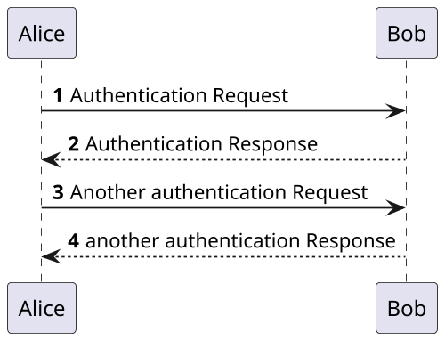

# 测试页面

## 标题测试222

> An awesome project.
> An awesome project.
> An awesome project.
> An awesome project.
> An awesome project.
> An awesome project.
> An awesome project.

## emoji测试

:100: :100:

## 代码Copy测试

```go
package main

import "fmt"

func main() {
    fmt.Println("Hello, World!")
}
```

```python
print("Hello, World!")
```

```bash
echo "Hello, World!"
```

!> `cpp`的代码提示不太好用

```cpp
#include <iostream>

int main()
{
	std::cout << "Hello, World!" << std::endl;
	return 0;
}
```

?> _TODO_ blablablabl

aaaaaabbbb，巴拉巴拉巴拉巴比伦

1. 123123asdasdj
2. asdoiuvhjuahsoqwe
3. asoijvoijasd;oist



```algorithm
% This quicksort algorithm is extracted from Chapter 7, Introduction to Algorithms (3rd edition)
\begin{algorithm}
\caption{Quicksort}
\begin{algorithmic}
\PROCEDURE{Quicksort}{$A, p, r$}
    \IF{$p < r$} 
        \STATE $q = $ \CALL{Partition}{$A, p, r$}
        \STATE \CALL{Quicksort}{$A, p, q - 1$}
        \STATE \CALL{Quicksort}{$A, q + 1, r$}
    \ENDIF
\ENDPROCEDURE
\PROCEDURE{Partition}{$A, p, r$}
    \STATE $x = A[r]$
    \STATE $i = p - 1$
    \FOR{$j = p$ \TO $r - 1$}
        \IF{$A[j] < x$}
            \STATE $i = i + 1$
            \STATE exchange
            $A[i]$ with $A[j]$
        \ENDIF
        \STATE exchange $A[i]$ with $A[r]$
    \ENDFOR
\ENDPROCEDURE
\end{algorithmic}
\end{algorithm}
```

单独渲染的公式 

$$
\begin{array}{rrrrrr|r}
               & x_1 & x_2 & s_1 & s_2 & s_3 &    \\ \hline
           s_1 &   0 &   1 &   1 &   0 &   0 &  8 \\
           s_2 &   1 &  -1 &   0 &   1 &   0 &  4 \\
           s_3 &   1 &   1 &   0 &   0 &   1 & 12 \\ \hline
               &  -1 &  -1 &   0 &   0 &   0 &  0
\end{array}
$$

再来一个

$$
\mu_0=4\pi\times10^{-7} \ \left.\mathrm{\mathrm{T}\!\cdot\!\mathrm{m}}\middle/\mathrm{A}\right.

$$

行内的公式 $ a = b \ c = d $
